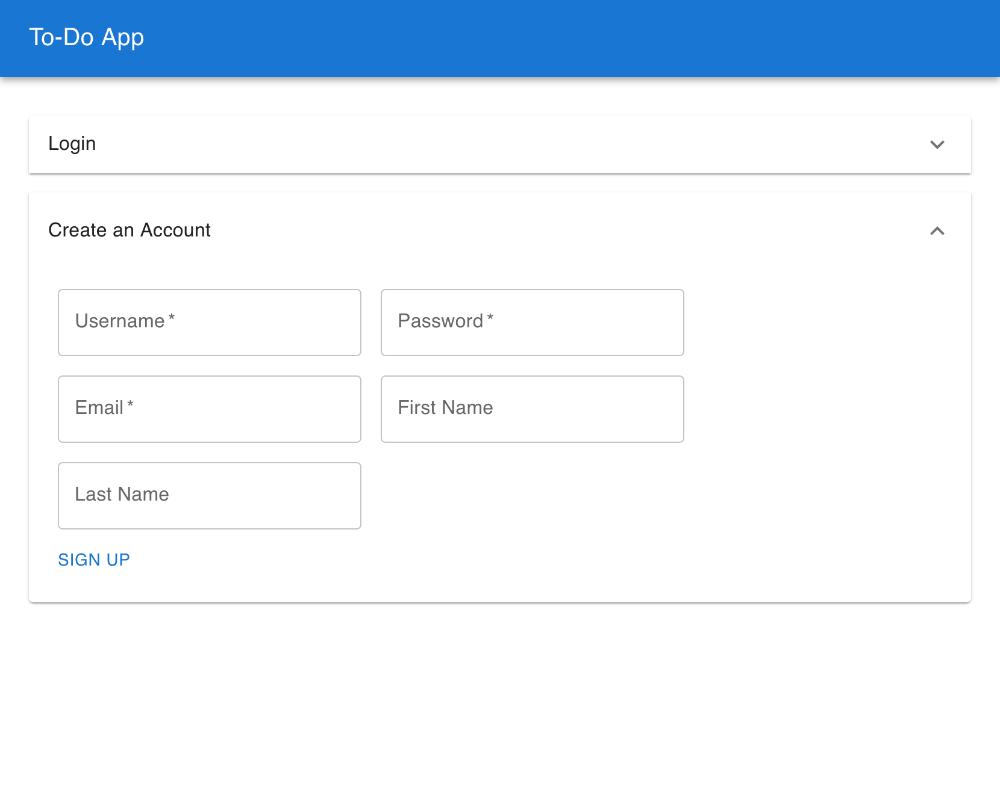
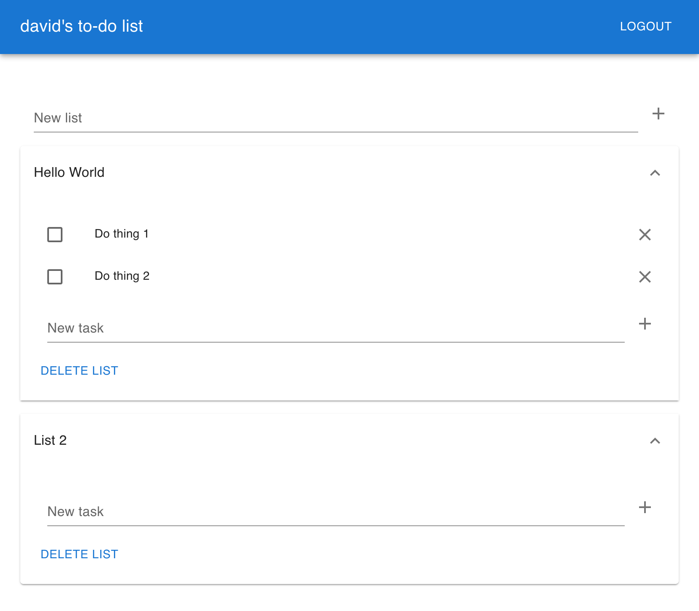

This is a demo of a modern web application using a RESTful API (written in Django + Django REST Framework) and single page web application written using Typescript and React.

It's a simple todo app that lets users create an account, create a list of tasks and add tasks to their list.

## Setup

### Run the API

This requires Python 3.

```shell
# create a python virtual env
python3 -m venv venv
source venv/bin/activate

# install the requirements
pip install -r requirements.txt

# start up the app
python api_server/manage.py migrate
python api_server/manage.py runserver
```

The api server should run on http://localhost:8000/

### Run the UI

This requires Node 16+.

```shell
# Install NPM requirements
cd webserver/
npm ci

# Run the UI
npm start
```

The web UI should run on http://localhost:3000/


## Screenshots

Create a new user



To do list


